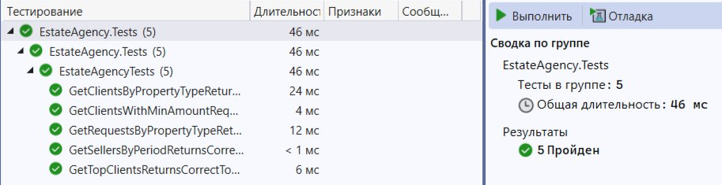

# Разработка корпоративных приложений
[Таблица с успеваемостью](https://docs.google.com/spreadsheets/d/1JD6aiOG6r7GrA79oJncjgUHWtfeW4g_YZ9ayNgxb_w0/edit?usp=sharing)

### Лабораторные работы

1.	«Классы» - Реализация объектной модели данных и unit-тестов

  
В рамках первой лабораторной работы необходимо подготовить структуру классов, описывающих предметную область, определяемую в задании. В каждом из заданий присутствует часть, связанная с обработкой данных, представленная в разделе «Unit-тесты». Данную часть необходимо реализовать в виде unit-тестов: подготовить тестовые данные, выполнить запрос с использованием LINQ, проверить результаты.  

Хранение данных на этом этапе допускается осуществлять в памяти в виде коллекций.  
Необходимо включить **как минимум 10** экземпляров каждого класса в датасид. 

## «Риэлторское агентство»
В агентстве хранится информация об объектах недвижимости, контрагентах и заявках от них.

Объект недвижимости характеризуется типом, назначением, кадастровым номером, адресом, этажностью, общей площадью, числом комнат, высотой потолков, этажом расположения, наличием обременений.
Тип объекта недвижимости является перечислением.
Назначение объекта недвижимости является перечислением.

Контрагент характеризуется ФИО, номером паспорта, контактным телефоном.

Заявка содержит информацию о контрагенте, объекте недвижимости, типе заявки- покупка/продажа, денежной сумме.
Используется в качестве контракта.

## Классы:
* [PropertyPurpose] - Назначение объекта недвижимости
* [PropertyType] - Тип объекта недвижимости
* [RequestType] - Тип заявки от клиента
* [Client] - Класс, представляющий клиента 
* [Property] - Класс, представляющий объект недвижимости
* [Request] - Класс, представляющий заявку от клиента

## Юнит-тесты:
* GetSellersByPeriodReturnsCorrectSellers() - Вывести всех продавцов, оставивших заявки за заданный период.
* GetTopClientsReturnsCorrectTopLists() - Вывести топ 5 клиентов по количеству заявок (отдельно на покупку и продажу).
* GetRequestsByPropertyTypeReturnsCorrectCounts() - Вывести информацию о количестве заявок по каждому типу недвижимости.
* GetClientsWithMinAmountRequestsReturnsCorrectClients() - Вывести информацию о клиентах, открывших заявки с минимальной стоимостью.
* GetClientsByPropertyTypeReturnsSortedClients() - Вывести сведения о всех клиентах, ищущих недвижимость заданного типа, упорядочить по ФИО.

Результаты юнит-тестов

